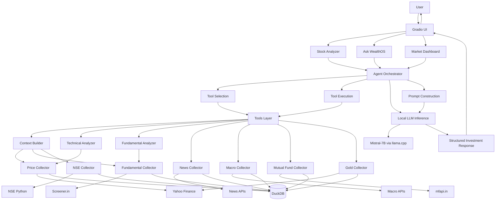

# WealthOS — AI Investment Advisory for Indian Markets

AI-powered investment advisor for Indian markets using local LLM inference (Mistral-7B via llama.cpp), modular data collectors/analyzers, and DuckDB caching to deliver structured stock analysis, fundamental/technical insights, and advisory responses—built for clarity, portability, and technical depth.

## Overview
WealthOS is an AI investment advisory system focused on Indian capital markets (NSE/BSE). It combines local LLM inference with a modular pipeline of data collectors and analyzers to provide structured, data-driven stock analysis and investment guidance. The system emphasizes transparency, technical soundness, and specialization in Indian market specifics without claiming production-scale readiness.

## Runtime Environment
- Developed and tested primarily on Google Colab T4 GPU
- Notebooks are intentionally excluded from version control to focus on modular source architecture
- Repository contains the core Python source code (collectors, analyzers, llm, ui) for clarity and portability

## Highlights
- **Local LLM Inference**: Runs Mistral-7B Q4_K_M via llama.cpp for privacy and cost control
- **Tool-Augmented AI Architecture**: Agent dynamically selects tools (price, fundamentals, technicals, news, macro, MF, gold) to ground responses in real data
- **Financial Intelligence Pipeline**: Computes fundamental ratios, technical indicators, and builds contextual summaries from multiple sources
- **Modular Collector/Analyzer System**: Separates data acquisition from analysis for maintainability and extensibility
- **DuckDB Caching Layer**: Embedded analytical database caches API responses to reduce external calls and enable fast queries
- **Indian Capital Markets Specialization**: Handles NSE/BSE symbols, SEBI regulations, INR currency, and India-specific financial metrics

## Architecture

## Technical Design Decisions
- **DuckDB for Persistence**: Chosen as an embedded analytical database for zero-configuration storage, ACID transactions, and efficient analytical queries on financial time series without needing a separate database server.
- **Local LLM Inference**: Used llama.cpp to run Mistral-7B Q4_K_M locally for data privacy, cost control, and reduced latency, avoiding reliance on external APIs.
- **Modular Collector/Analyzer Design**: Separated data collection from analysis to allow independent updates, testing, and extension of data sources or analytical methods.
- **Gradio for UI**: Selected for rapid development of interactive machine learning demos with minimal frontend effort, enabling direct interaction with the LLM agent.

## Project Structure
```
├── README.md                 # This file
├── requirements.txt          # Python dependencies
├── .gitignore               # Git ignore patterns
├── .env.example             # Environment variable template
├── LICENSE                  # MIT License
├── ui/
│   ├── app.py               # Main Gradio application
│   ├── app_launch.py        # Alternative launch script
│   └── cell_39_launch.py    # Colab launch cell
├── llm/
│   ├── agent.py             # Agent orchestration and tool selection
│   ├── llm_loader.py        # Model loading and inference
│   └── tools.py             # Tool interface definitions
├── analyzers/
│   ├── context_builder.py   # Assembles comprehensive stock context
│   ├── fundamental_analyzer.py # Financial ratio computation and scoring
│   └── technical_analyzer.py # Technical indicator calculations
├── collectors/
│   ├── price_collector.py   # Stock price data with caching
│   ├── fundamental_collector.py # Financial statements and ratios
│   ├── macro_collector.py   # Economic indicators
│   ├── news_collector.py    # News sentiment analysis
│   ├── nse_collector.py     # NSE-specific data (shareholding, governance)
│   ├── mf_collector.py      # Mutual fund data
│   └── gold_collector.py    # Gold price tracking
└── experiments/             # Historical test/debug utilities
```

## Setup
### Prerequisites
- Python 3.12
- GPU recommended for LLM inference (tested on Tesla T4)
- Approximately 8GB free disk space for model and database

### Installation
1. Clone the repository
2. Install dependencies: `pip install -r requirements.txt`
3. Download the Mistral-7B GGUF model and place it in the models directory:
   ```bash
   mkdir -p models
   # Download mistral-7b-instruct-v0.3.Q4_K_M.gguf to ./models/
   ```
4. Configure environment variables (optional):
   ```bash
   cp .env.example .env
   # Edit .env to customize paths if needed
   ```
5. Launch the application: `python ui/app.py`

## Usage Examples
### Stock Analysis
1. Navigate to the "Stock Analyzer" tab
2. Enter an NSE stock symbol (e.g., RELIANCE, TCS, HDFCBANK)
3. Click "Analyze" to receive:
   - Current price snapshot
   - Technical analysis (RSI, MACD, DMA, signals)
   - Fundamental analysis (P/E, ROE, debt ratios, quality grade)
   - Shareholding and governance data
   - News sentiment
   - Macro market context
   - Structured investment advice (BUY/HOLD/SELL with confidence)

### General Investment Questions
1. Navigate to the "Ask WealthOS" tab
2. Enter your investment question (e.g., "Where should I invest ₹5 lakhs for 5 years?")
3. Click "Ask WealthOS" to receive:
   - Data gathering from relevant sources
   - AI-generated advisory response in CFA-style format
   - Specific recommendations with reasoning and risk disclosure

### Market Dashboard
1. Navigate to the "Market Dashboard" tab
2. Click "Refresh Data" to load:
   - Current gold prices (via GoldBees ETF)
   - Macro indicators (VIX, USD/INR, RBI repo rate, etc.)
   - Market regime assessment

## Limitations
1. **Environment**: Developed and tested primarily in Google Colab T4 GPU environment
2. **Data Sources**: Relies on free/freemium APIs which may have rate limits or availability issues
3. **Model Size**: Uses 7B parameter model; larger models may provide better reasoning but require more VRAM
4. **Real-time Data**: Data freshness depends on collection frequency (not true real-time streaming)
5. **Geographic Focus**: Specifically designed for Indian markets (NSE/BSE, INR, SEBI rules)
6. **Advisory Disclaimer**: Outputs include disclaimer that this is not SEBI-registered investment advice
7. **Single-user Design**: Gradio interface not optimized for high concurrent user loads
8. **No Authentication**: Intended for personal/local use; multi-user deployment would require additional security

## Future Improvements
1. **Deployment**: Add Docker containerization for easier deployment
2. **Monitoring**: Implement logging, metrics, and health checks
3. **Caching**: Add Redis layer for frequent query caching
4. **Model Options**: Support for multiple LLM sizes and quantization levels
5. **Backtesting**: Add strategy validation engine
6. **Notifications**: Email/Webhook alerts for price targets or signal changes
7. **Multi-language**: Support for regional Indian languages
8. **Portfolio Tracking**: Personal portfolio performance monitoring
9. **Advanced ML**: Fine-tuning on domain-specific financial data
10. **API Layer**: REST/FastAPI backend for programmatic access

## Environment Variables
The following environment variables can be configured (see `.env.example`):
- `WEALTHOS_DB_PATH`: Path to DuckDB database file (default: `./db/wealthos.duckdb`)
- `WEALTHOS_MODEL_PATH`: Path to Mistral-7B GGUF model file (default: `./models/mistral-7b-instruct-v0.3.Q4_K_M.gguf`)

## Contributing
This project was created as a personal learning exercise. Contributions are welcome but please:
1. Maintain the existing architecture and patterns
2. Preserve Indian market specificity
3. Keep the educational disclaimer intact
4. Ensure compatibility with the Colab T4 GPU environment

## License
MIT License - see LICENSE file for details.
